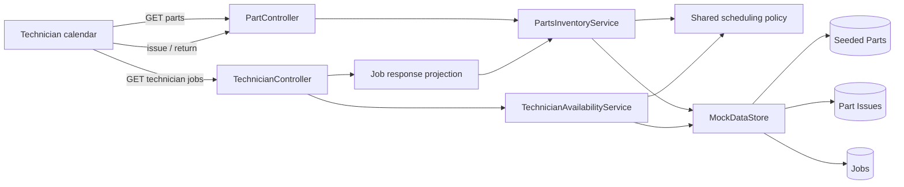

# ADR: Job-Linked, Time-Derived Parts Reservations

| Field | Value |
|---|---|
| **Status** | Proposed |
| **Date** | 2026-09-22 |
| **Requirements** | `requirments.md` |

## Context

Feature 2 adds a fixed, seeded parts catalog and allows a technician to issue part quantities against one of their booked jobs. Issued quantities affect shared stock during the job's travel-buffered time window, can be returned early, must move when the job is rebooked, and must appear both in current inventory counts and in each job row.

ServiceForge currently uses Java 17, Spring Boot 3, Angular, and a singleton in-memory `MockDataStore`. `Job` owns the technician identity and scheduled start/end times. `TechnicianAvailabilityService.TRAVEL_BUFFER_MINUTES` is 45 and the active overlap rule now applies that buffer to bookings. The project requires constructor injection, service-owned business logic, `ResponseEntity` controller responses, and Angular HTTP calls through services.

The main design problem is that inventory has two views of the same source data:

- current availability, which depends on the observation time; and
- parts allocated to a job, which persists before, during, and after the active hold until returned.

Persisting `available` or copied hold timestamps would let those views drift when time advances or a job is rebooked.

## Decision Drivers

- Preserve `available + inUse = total` and prevent negative quantities.
- Reject an issue atomically when shared stock is insufficient anywhere in its job window.
- Derive hold timing from the linked job and the same 45-minute policy used by scheduling.
- Make a rebooked job move its parts hold without synchronizing duplicate timestamps.
- Keep the availability table and `Parts Used` column backed by one source of truth.
- Make time-boundary behavior deterministic and testable.
- Fit the existing in-memory, package-by-layer architecture without adding a database.

## Constraints

- The catalog contains exactly `P001` through `P004`, seeded at application startup; runtime catalog administration is out of scope.
- Parts and issue records remain in memory and reset on restart.
- An issue belongs to exactly one part, job, and technician; the job must belong to that technician.
- Issue and return quantities are positive integers. No partial issue fulfillment is allowed.
- Inventory is shared across technicians.
- The 45-minute value must have one authoritative definition.
- The active no-overlap booking rule remains applicable to job scheduling; this feature must not weaken it.
- Existing REST error conventions use `ApiError`; validation errors should be `400`, missing resources `404`, and stock/state conflicts `409`.

## Considered Options

### Option 1: Store mutable available and in-use counters

Each `Part` stores `total`, `available`, and `inUse`. Timers or request-time reconciliation move quantities between counters at hold boundaries.

#### Benefits

- Listing inventory is a simple read.
- The model resembles the columns shown in the UI.

#### Costs and Risks

- Counters become stale as wall-clock time passes without a request or background scheduler.
- Rebooking requires finding and moving scheduled transitions.
- Multiple mutable counters can violate the reconciliation invariant.
- A scheduler adds lifecycle, race, and test complexity that is disproportionate for an in-memory application.

### Option 2: Store immutable reservation windows on issue records

Each issue copies the job start/end plus the buffer when it is created. Counts are derived from records active at the observation time.

#### Benefits

- No scheduler or mutable aggregate counters are required.
- Historical allocation windows remain explicit.

#### Costs and Risks

- Rebooking creates stale windows unless every job edit also updates issue records.
- The copied buffer and timestamps introduce duplicate sources of truth.
- Cross-service updates become necessary to preserve consistency.

### Option 3: Store job-linked issue quantities and derive windows and counts

Store fixed part totals and outstanding issue quantities keyed by part and job. At query or command time, resolve each issue's current job and derive its buffered window from the job timestamps and one shared scheduling policy. Inject a `Clock` into inventory logic so the current view is deterministic in tests.

#### Benefits

- Job edits automatically move holds because timestamps are never copied.
- Current counts cannot become stale merely because time advances.
- `PartIssue` is the single source for stock calculations and job display.
- Fixed totals plus derived counts make reconciliation straightforward.
- No background process or external infrastructure is required.

#### Costs and Risks

- Reads and issue validation scan in-memory jobs and issue records.
- Correct interval-capacity validation is more involved than checking current availability.
- Retaining completed allocations indefinitely would require a later history/cleanup policy.

## Decision

Adopt Option 3.

Add a fixed `Part` aggregate containing `id`, `name`, and `totalQuantity`, and a mutable `PartIssue` containing its identity, `partId`, `jobId`, `technicianId`, and positive `outstandingQuantity`. `MockDataStore` owns the four seeded parts and all issue records and provides lookup and mutation operations. Issue records with zero outstanding quantity are removed.

Move the 45-minute value into one shared backend scheduling policy abstraction used by both technician conflict detection and parts-window calculations. Do not define a second parts-specific constant. A buffered job interval starts at `job.startTime - 45 minutes` and ends at `job.endTime + 45 minutes`.

`PartsInventoryService` owns issue, return, capacity, and projection logic. It receives `MockDataStore` and `Clock` by constructor injection. Inventory list responses are projections calculated at the service's current instant; model objects do not store `available` or `inUse`.

For a candidate issue, the service validates the technician, job ownership, part, and quantity before mutation. It then computes the greatest quantity already reserved for the same part at any point in the candidate job's buffered interval. Because reservation intervals and quantities are piecewise constant, checking interval boundary events is sufficient. The request succeeds only when:

$$
\max_{t \in W_{candidate}} reserved(part,t) + requested \le total(part)
$$

The check and insertion execute under the data store's inventory lock so concurrent requests cannot both observe the same capacity and over-allocate it. Failed commands perform no mutation.

A return addresses a specific `(jobId, partId)` allocation for the requesting technician and reduces its outstanding quantity atomically. Returning more than outstanding is `400`. Reducing to zero removes the issue. If the issue is active at the current instant, the inventory projection changes immediately; outside its window, current availability was already unaffected, but future allocation is released.

Expose inventory commands and queries through a dedicated `PartController`. Extend job response DTOs with a stable, part-id-sorted `partsUsed` representation derived from the same issue records. Do not add issue collections directly to `Job`, because that would couple the scheduling model to mutable inventory state and create two ownership paths.

## Architecture and Data Flow

Issue flow:

1. The UI submits technician, job, part, and quantity.
2. The controller validates request shape and delegates to `PartsInventoryService`.
3. The service confirms all referenced entities and job ownership.
4. Under one inventory lock, it derives the candidate job window, calculates peak overlapping allocation for that part, and either inserts/updates the issue or rejects without mutation.
5. The response returns the updated allocation and/or current part projection; the UI refreshes jobs and parts from their query endpoints.

Current inventory flow:

1. The service obtains `Clock.instant()` once for a consistent snapshot.
2. It resolves each outstanding issue against its current job times.
3. It sums quantities whose buffered windows contain the observation instant.
4. For each part, `available = total - inUse`; the result is sorted by part id.

## Interfaces and Data Model

Backend domain and policy:

- `Part { id: String, name: String, totalQuantity: int }`
- `PartIssue { id: Long, partId: String, jobId: Long, technicianId: Long, outstandingQuantity: int }`
- `SchedulingWindowPolicy` exposes the single 45-minute buffer and derives buffered job windows.
- `MockDataStore` adds all-job lookup, part lookup/listing, issue lookup/listing, issue id generation, and atomic inventory mutation support.

REST interfaces:

- `GET /api/parts` returns `PartAvailabilityResponse[]` with `id`, `name`, `inUse`, `available`, and `total` at one observation instant.
- `POST /api/parts/{partId}/issues` accepts `{ technicianId, jobId, quantity }` and returns `201` with the resulting issue allocation.
- `POST /api/parts/{partId}/returns` accepts `{ technicianId, jobId, quantity }` and returns `200` with the remaining allocation.
- `GET /api/technicians/{technicianId}/jobs` retains its route but returns job DTOs with `partsUsed: string`, sorted by part id and blank when no outstanding issues exist.

Error mapping:

- `400 ApiError`: non-positive quantity, return greater than outstanding, malformed request.
- `404 ApiError`: missing technician, job, part, or issue allocation.
- `409 ApiError`: insufficient stock for the candidate window.

Frontend additions:

- `PartAvailability` and issue/return request models.
- A dedicated `PartsService` for parts HTTP operations; components do not call `HttpClient` directly.
- The existing calendar component loads parts on initialization and refreshes both parts and jobs after successful issue/return operations.
- The existing jobs table adds `Parts Used`; the parts table appears directly below the booking panel and renders the four required columns.

## Consequences

### Positive

- Time progression and job rebooking cannot leave stored availability or hold timestamps stale.
- Both UI views are reconciled from the same issue records.
- Capacity is enforced across all overlapping technicians' buffered job windows, not only at the current instant.
- An injected clock enables exact before, boundary, and after tests.
- Atomic command handling preserves all-or-nothing behavior in the singleton in-memory store.

### Negative

- The service performs linear scans suitable for the seeded in-memory scope but not a large production inventory.
- Job query projection now depends on inventory data.
- Explicit locking is required because the existing mutable lists are not thread-safe.
- The REST API exposes commands but the current requirements do not specify UI controls for issuing and returning parts.

### Risks and Mitigations

- **Boundary ambiguity:** the requirements say both that stock is available starting exactly at the buffered end and that the buffered end instant is inclusive. Implement the explicit edge-case rule as inclusive pending confirmation, and pin it with tests; see Open Questions.
- **Shared constant drift:** centralize the buffer in `SchedulingWindowPolicy` and test both booking and inventory behavior against it.
- **Concurrent over-allocation:** perform capacity check and issue mutation under one lock and add a concurrency-focused service test.
- **Inconsistent snapshots:** capture the clock once per list operation and project all rows from that instant.
- **Invalid orphan issues:** validate references before insertion and keep issue mutation APIs internal to the service/data layer.
- **API compatibility:** replace raw `Job` serialization with a response DTO that preserves existing field names and adds only `partsUsed`.

## Requirement Traceability

| Requirement | Architecture element | Verification point |
|---|---|---|
| Exactly four seeded parts | `MockDataStore.seed`, immutable `Part` identity/total | Fresh-context repository/controller test checks ids, positive totals, and one total of 3 |
| Live parts list | `GET /api/parts`, clock-derived projection | Controller test at fixed instants before, during, and after a hold |
| Issue against owned job | `PartsInventoryService.issue`, ownership validation | Service/controller tests for success, missing ids, and wrong technician |
| Shared stock and no partial issue | Peak interval capacity check under lock | Overlapping-window and unchanged-after-409 tests |
| Exact 45-minute linkage | Shared `SchedulingWindowPolicy` | Boundary tests and existing booking conflict tests |
| Rebooking moves hold | Resolve job timestamps at calculation time | Mutate/rebook job time and verify old/new window projections |
| Return/restock | Atomic reduction/removal of `PartIssue` | Partial, full, excessive, inactive, and active return tests |
| Reconciliation invariant | Derived `inUse` and `available` from fixed total | Tests assert non-negative counts and sum equals total after command sequences |
| Parts availability panel | Angular `PartsService` and table below booking panel | Component HTTP/render tests for required columns and refreshed values |
| Per-job `Parts Used` | Job response projection sorted by part id | Backend formatting and Angular blank/reduced/removed rendering tests |

## Open Questions

1. At exactly `job.endTime + 45 minutes`, should the issue still be in use? The edge-case section says yes (inclusive), while Story 3 says the unit is available starting at that instant. This ADR provisionally follows the explicit edge-case rule; human approval should settle the contradiction before implementation.
2. The requirements mandate backend issue/return capability but only explicitly require the parts table and `Parts Used` column in the UI. Should issue and return controls be added to the technician screen, or are those commands API-only for Feature 2?
3. Job editing/rebooking is described as behavior the design must tolerate, but no edit endpoint currently exists. Is implementing job editing part of Feature 2, or should only the inventory design and tests prove that changed job timestamps are followed when such editing is introduced?
